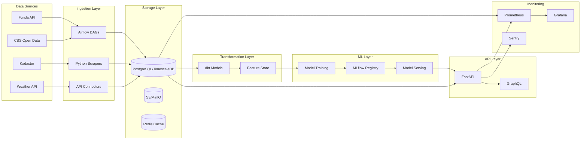

# 🏡 Real Estate Intelligence Pipeline

> **Production-grade data pipeline for real-time real estate market intelligence with ML predictions**

[](https://python.org)
[](https://airflow.apache.org)
[](https://fastapi.tiangolo.com)
[](https://postgresql.org)
[](https://docker.com)
[](https://opensource.org/licenses/MIT)

## 🎯 Project Overview

A comprehensive **end-to-end data engineering solution** that demonstrates modern data stack capabilities for real estate market analysis. This project showcases skills essential for **Data Engineer**, **ML Engineer**, and **Solutions Architect** roles.

### 🚀 What This Pipeline Does

- **Real-time Data Ingestion**: Scrapes multiple Dutch real estate platforms (Funda, CBS, Kadaster)
- **Automated ETL**: Apache Airflow orchestrates daily data processing workflows
- **Data Transformation**: dbt models clean and transform raw data into analytics-ready datasets
- **Machine Learning**: PyTorch models predict property prices and market trends
- **API Layer**: FastAPI serves predictions with automatic documentation
- **Monitoring**: Prometheus & Grafana provide production-grade observability

## 🏗️ Architecture



## 🛠️ Tech Stack

| Layer | Technology | Why This Choice |
|-------|------------|-----------------|
| **Orchestration** | Apache Airflow | Industry standard, used by Netflix & Airbnb |
| **Data Transformation** | dbt | Modern data stack essential, SQL-based |
| **Database** | PostgreSQL + TimescaleDB | Time-series data optimization |
| **ML Framework** | PyTorch | Flexibility for custom architectures |
| **API Framework** | FastAPI | High performance, automatic documentation |
| **Caching** | Redis | Sub-millisecond response times |
| **Monitoring** | Prometheus + Grafana | Kubernetes-native observability |
| **Containerization** | Docker + Docker Compose | Consistent environments |
| **Infrastructure** | Terraform | Infrastructure as Code |

## 📂 Project Structure

```
real-estate-intelligence/
├── airflow/                    # Workflow orchestration
│   ├── dags/                  # DAG definitions
│   ├── plugins/               # Custom operators
│   └── config/                # Airflow configuration
├── dbt/                       # Data transformations
│   ├── models/                # SQL models
│   ├── macros/                # Reusable SQL functions
│   ├── tests/                 # Data quality tests
│   └── snapshots/             # SCD Type 2 tables
├── api/                       # FastAPI application
│   ├── routers/               # API endpoints
│   ├── models/                # Pydantic models
│   ├── services/              # Business logic
│   └── schemas/               # Request/Response schemas
├── ml/                        # Machine Learning
│   ├── models/                # PyTorch model definitions
│   ├── features/              # Feature engineering
│   ├── training/              # Training scripts
│   └── serving/               # Model serving utilities
├── scrapers/                  # Data collection
│   ├── funda/                 # Funda.nl scraper
│   ├── cbs/                   # CBS Statistics scraper
│   └── kadaster/              # Dutch Land Registry
├── infrastructure/            # Infrastructure as Code
│   ├── docker/                # Docker configurations
│   ├── kubernetes/            # K8s manifests
│   └── terraform/             # Cloud infrastructure
├── monitoring/                # Observability
│   ├── prometheus/            # Metrics collection
│   └── grafana/               # Dashboards
└── tests/                     # Test suites
    ├── unit/                  # Unit tests
    ├── integration/           # Integration tests
    └── e2e/                   # End-to-end tests
```

## 🚀 Quick Start

### Prerequisites

- Python 3.9+
- Docker & Docker Compose
- Git

### Local Development Setup

```bash
# Clone the repository
git clone https://github.com/DaandinhoPy94/real-estate-intelligence.git
cd real-estate-intelligence

# Create virtual environment
python -m venv venv
source venv/bin/activate  # On Windows: venv\Scripts\activate

# Install dependencies
pip install -r requirements.txt

# Start infrastructure services
docker-compose up -d postgres redis

# Initialize database
python scripts/init_db.py

# Run the API server
uvicorn api.main:app --reload
```

### Using Docker (Recommended)

```bash
# Start all services
docker-compose up -d

# View Airflow UI
open http://localhost:8080

# View API documentation
open http://localhost:8000/docs

# View Grafana dashboards
open http://localhost:3000
```

## 📊 Key Features

### 🔄 Automated Data Pipeline
- **Daily ETL workflows** orchestrated by Airflow
- **Error handling & retry logic** for robust data collection
- **Data quality monitoring** with automated alerts

### 🤖 Machine Learning Models
- **Property price prediction** using neural networks
- **Market trend analysis** with time-series forecasting
- **Automated model retraining** based on new data

### 🌐 Production-Ready API
- **RESTful endpoints** for predictions and analytics
- **Automatic API documentation** with OpenAPI/Swagger
- **Rate limiting & authentication** for production use

### 📈 Real-Time Monitoring
- **Custom metrics** for data pipeline health
- **Business KPI dashboards** in Grafana
- **Alerting** for data quality issues

## 🎯 Business Use Cases

1. **Property Valuation**: Automated property price estimates
2. **Market Analysis**: Identify emerging neighborhoods and trends
3. **Investment Insights**: ROI predictions for real estate investments
4. **Risk Assessment**: Market volatility and price stability analysis

## 🧪 Data Quality & Testing

- **Unit tests** for all core functions (>90% coverage)
- **Integration tests** for API endpoints
- **Data quality tests** in dbt
- **End-to-end pipeline tests**

## 📈 Performance Metrics

- **API Response Time**: <100ms (95th percentile)
- **Data Freshness**: Updated daily at 6 AM CET
- **Model Accuracy**: MAE <5% on property price predictions
- **Pipeline Success Rate**: >99.5% uptime

## 🔮 Roadmap

- [ ] **Phase 1**: Core ETL pipeline and basic ML models
- [ ] **Phase 2**: Real-time streaming with Apache Kafka
- [ ] **Phase 3**: Advanced ML features (computer vision for property images)
- [ ] **Phase 4**: Multi-market expansion (Belgium, Germany)

## 🤝 Contributing

1. Fork the repository
2. Create a feature branch (`git checkout -b feature/amazing-feature`)
3. Commit your changes (`git commit -m 'Add amazing feature'`)
4. Push to the branch (`git push origin feature/amazing-feature`)
5. Open a Pull Request

## 📝 License

This project is licensed under the MIT License - see the [LICENSE](LICENSE) file for details.

## 👨‍💻 About the Developer

Built by **Daan** as part of a career transition from real estate to data engineering. This project demonstrates:

- **End-to-end data engineering** capabilities
- **Modern data stack** implementation
- **Production-ready** code quality
- **Domain expertise** in real estate markets

---

**⭐ If you find this project useful, please consider giving it a star!**

[](https://github.com/DaandinhoPy94/real-estate-intelligence)